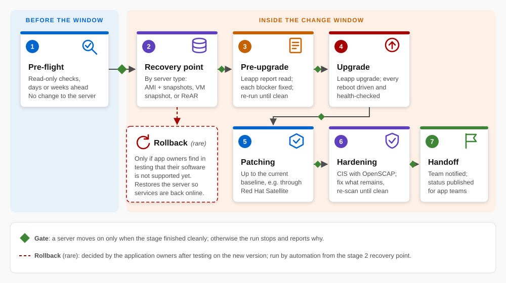

# RHEL major-version in-place upgrade method

A reference method for upgrading large fleets of production Red Hat Enterprise Linux (RHEL)
servers to the next major version **in place**, from beginning to end, as one repeatable,
low-risk operation.

> **What this repository is:** a written methodology with checklists, short illustrative
> snippets and skeleton templates. **It is not a working product.** The snippets and templates
> show the shape of each step; a real implementation has to be built and customized for each
> environment (see [docs/07-adapting-to-your-organization.md](docs/07-adapting-to-your-organization.md)).

## The problem

Routine patching inside one RHEL major version is well understood. The hard step comes at the
end of a major version's life cycle, when servers must move to the next major version. Red Hat's
supported tool for an in-place upgrade, **Leapp**, performs the version change itself. Everything
around it is left to the engineer: a recovery point, fixing upgrade blockers, the reboots,
patching to the current baseline, security hardening, and rolling back if something fails.
Done by hand, that is a long sequence of steps that each need senior engineering judgment, so
many organizations defer the upgrade and keep running versions at or past end of maintenance.

This method automates all of the work around Leapp, so the in-place path becomes the faster
and safer choice.

## The method at a glance

An automation run (for example an Ansible playbook) carries each server through these stages,
with a gate between stages so a server only moves on when it is safe:

  

| # | Stage | What happens |
|---|-------|--------------|
| 1 | Pre-flight validation | Read-only checks, run days or weeks before the change window |
| 2 | Recovery point | A full backup or snapshot suited to the server type (cloud, virtual, physical) |
| 3 | Leapp pre-upgrade + remediation | Read the Leapp report, fix each blocker, re-run until clean |
| 4 | Upgrade | Run the Leapp upgrade and drive every reboot, waiting for a healthy state |
| 5 | Patching | Bring the upgraded server to the current patch baseline (e.g. through Red Hat Satellite) |
| 6 | Hardening | CIS benchmark with OpenSCAP remediation, then fix what remains and re-scan until clean |
| 7 | Completion and handoff | Notify the team and publish the server's status for the next teams |
| — | Rollback | A separate, unattended automation that restores the recovery point |

Details: [docs/02-stages.md](docs/02-stages.md) and [docs/03-rollback.md](docs/03-rollback.md).

## Why it works

- **A junior analyst can run it.** The engineering judgment is encoded in the automation, so a
  competent Linux analyst runs batches of servers in parallel inside one change window
  ([docs/04-operating-model.md](docs/04-operating-model.md)).
- **Safe by design.** Every server gets a recovery point before any change. Rollback is rarely
  needed, and when it is (usually because an application turns out not to be supported yet on the
  new version), it is automated.
- **It gets smarter over time.** The automation only applies fixes it was taught. When it meets
  something new, usually in a lower environment, it stops and reports; the fix is then engineered
  once and coded in ([docs/05-improvement-loop.md](docs/05-improvement-loop.md)).

## Contents

| Path | Contents |
|------|----------|
| [docs/](docs/) | The method, stage by stage, and why it matters |
| [checklists/](checklists/) | Pre-flight, go/no-go, post-upgrade validation, rollback decision |
| [snippets/](snippets/) | Short illustrative examples (not a working playbook) |
| [templates/](templates/) | Skeleton inventory and variable files (not a working product) |
| [UPSTREAM-CONTRIBUTIONS.md](UPSTREAM-CONTRIBUTIONS.md) | Fixes I contributed to the open-source tools this method relies on |

## Built on standard components

Linux, Leapp, Red Hat Satellite, OpenSCAP with the CIS benchmark, ReAR (Relax-and-Recover),
and the AWS and VMware APIs. Nothing here depends on a particular organization.

## Roadmap

- **Next: RHEL-compatible distributions.** Distributions such as AlmaLinux upgrade between major
  versions with the same Leapp tool, through the AlmaLinux ELevate project. The next step is to
  extend this method's checks to those distributions, starting with the upstream Leapp fix the
  ELevate project asked for: counting leftover upgrade boot files as available `/boot` space
  ([oamg/leapp-repository#1604](https://github.com/oamg/leapp-repository/pull/1604)).

## Author and license

Written by Murilo Souza from his own professional experience. It contains no employer source
code or confidential material.

Licensed under the [Apache License 2.0](LICENSE).
